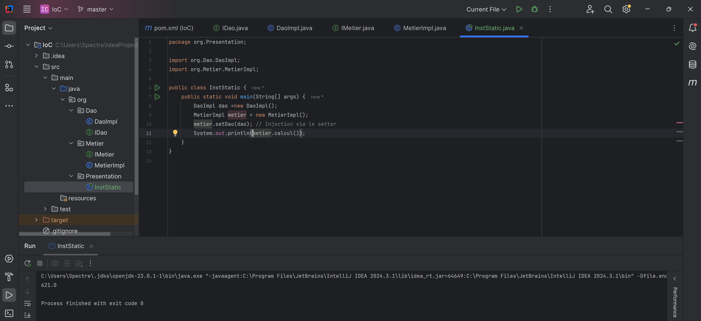
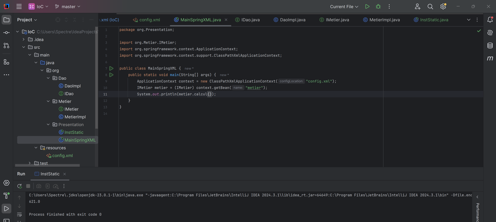
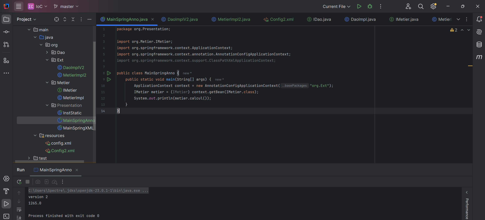

# Mini Framework IOC

Ce projet illustre les différentes techniques d'injection des dépendances en Java, incluant l'instanciation statique et l'utilisation du framework Spring.

## Approches d'Injection des Dépendances

### 1. Par Instanciation Statique
L'instanciation des objets est gérée directement dans le code source.

### 2. En utilisant Spring

L'injection des dépendances est gérée par le framework Spring via :
- **Configuration XML** : Définition des beans dans `config.xml`
  
  
- **Annotations** : Utilisation de `@Component`, `@Autowired`, etc.
  

## Auteur
- **Soukaina LAKBICHI** - (https://github.com/SoukainaLAKBICHI2)
